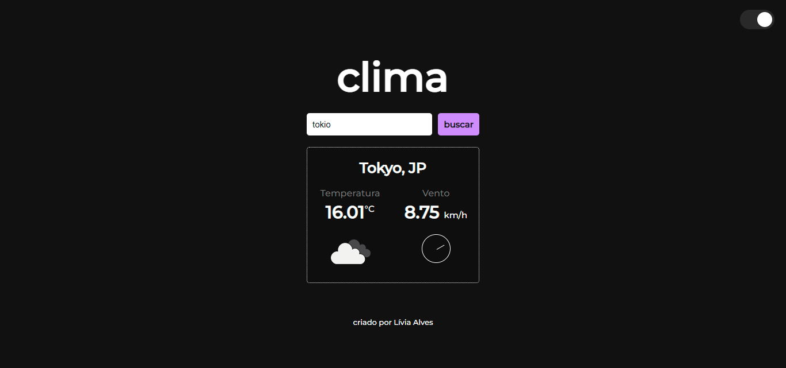

# Projeto Clima ⛈️

### Interface onde o usuário pode digitar o nome de uma cidade e assim, informações sobre temperatura e o vento, em tempo real, serão retornadas. Além disso, existe a opção de mudar a interface para modo claro ou escuro. 
Para a construção do prjeto foi usada a API OpenWeatherMap. 

